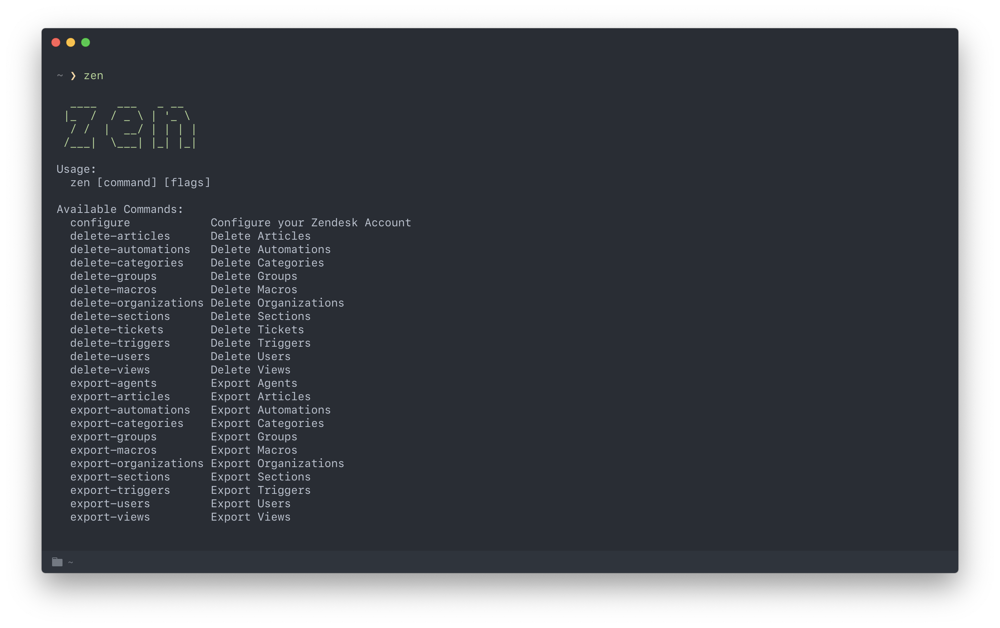

<p align="center">
  
<p align="center">Zendesk CLI</p>

<p align="center"></p>

## Installation

```
$ brew tap jackharrisonsherlock/zen
$ brew install zen
```


## Configuration

Run the following command and input your credentials, zen stores the configuration locally in ~/.zen.yaml

```
$ zen configure
```

This will guide you through the process of adding your subdomain, email and [API Key](https://support.zendesk.com/hc/en-us/articles/226022787-Generating-a-new-API-token-) to access your Zendesk account. 

## Commands

- Delete Automations
- Delete Categories
- Delete Groups
- Delete Macros
- Delete Organizations
- Delete Sections
- Delete Tickets
- Delete Triggers
- Delete Users
- Delete Views
- Export Agents
- Export Articles
- Export Automations
- Export Categories
- Export Groups
- Export Macros
- Export Triggers
- Export Sections
- Export Tickets
- Export Users
- Export Views

## Examples

```
$ zen export-users
```

If a file is required, you will need to be in the directory where the file is saved before running the command.

```
$ zen delete-users -f users.csv
```

## Other

- [Zendesk](https://www.zendesk.com/)
- [MEDIGO Zendesk Library](https://github.com/MEDIGO/go-zendesk)